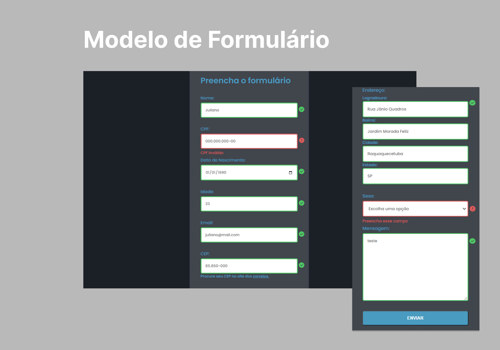

  

<h1 align="center"> Modelo de Formulário </h1>

Formulário com validações e auto-complete em alguns inputs.  

 

  
  <a href="https://jlisarte.github.io/projeto/" target="_blank">https://jlisarte.github.io/projeto/</a>

## 🚀 Tecnologias

Esse projeto foi desenvolvido com as seguintes tecnologias:

- HTML e CSS
- JavaScript
- Git e Github
- Figma

## 💻 Projeto

O DevLinks é um agregador de links para usar como cartão de visitas online.

---

Feito por Shadowkhan - Juliano Lisarte
